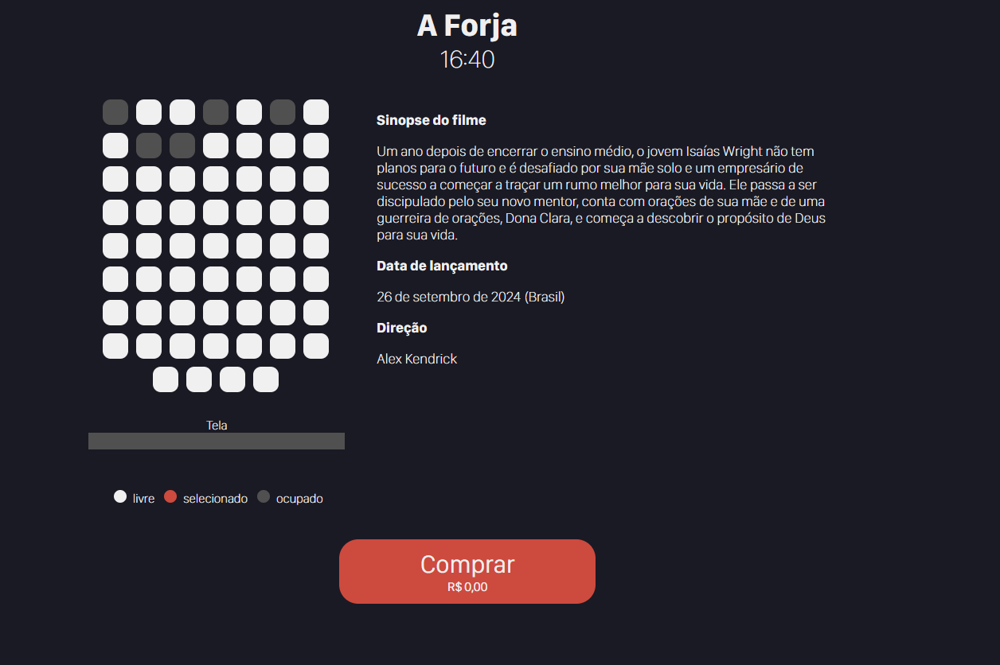
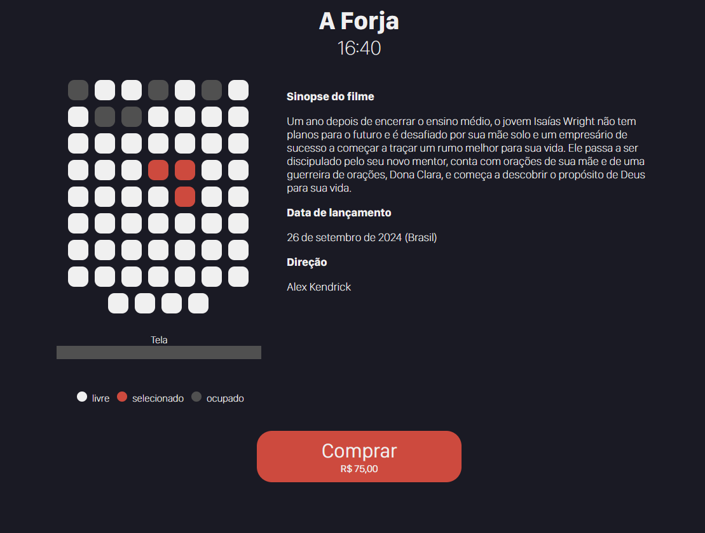
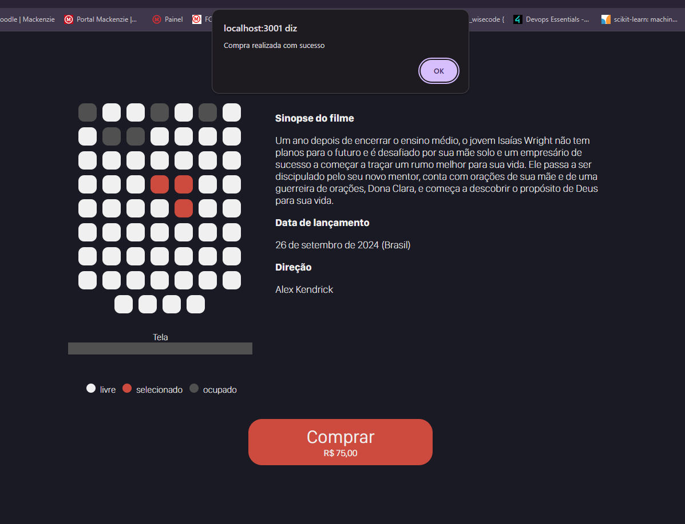

# POC 6 - CINEMA

## Feito Por:

- Artur Valladares Hernandez Giacummo - 10389053  
- Gabriel Marques Gonçalves Almeida - 10375711  


## Descrição

  Este projeto é uma prova de conceito (POC) que simula a reserva de ingressos para um cinema. A aplicação permite que os usuários selecionem assentos e simulem a compra dos ingressos, utilizando uma API local para fornecer informações dinâmicas sobre os filmes, assentos e preços. Neste tutorial, vamos guiá-lo pelo desenvolvimento dessa aplicação, desde a criação do projeto até a implementação de todas as funcionalidades.

  

## Tecnologias Utilizadas

  

-  **React.js**: Biblioteca para construção da interface de usuário.

-  **Next.js**: Framework para construção de aplicações web com React.

-  **CSS Modules**: Utilizado para estilizar componentes de maneira isolada.

-  **Node.js (Backend)**: Servidor local para fornecer dados da API simulada (dados de filmes, assentos e preços).

  

## Estrutura da POC

  A POC é composto por diversos componentes que interagem entre si para formar a aplicação final. Cada componente tem uma função específica, sendo responsável por uma parte importante da interface e da lógica de negócios. Abaixo, explico como esses componentes se organizam e como a comunicação entre eles ocorre.

A aplicação utiliza uma API local, que é uma simulação de um backend real, criada utilizando o JSON Server. Essa API local é responsável por fornecer os dados necessários para a interface, como as informações sobre o filme e os assentos disponíveis para compra. A estrutura da API é baseada no arquivo `db.json`, que contém os dados dos assentos e as informações sobre o filme, como título, sinopse, data de lançamento, direção, horário e preço, a aplicação não o manipula, apenas utiliza suas informações.

Quando a página é carregada, o frontend faz uma requisição para essa API para obter as informações necessárias.

## Passo a Passo: Desenvolvimento do Projeto

  

### 1. Criação do Projeto


Primeiro, criamos o projeto Next.js:

```bash
npx create-next-app@latest poc-cinema
cd poc-cinema
```


### 2. Estrutura de Componentes

Os principais componentes da aplicação estão organizados dentro da pasta components. Cada componente tem uma função específica que contribui para a interação e o fluxo da aplicação.
Os componentes principais são responsáveis por exibir as informações dinâmicas, gerenciar a interação do usuário (como a seleção de assentos) e calcular o preço total da compra. Abaixo, explicamos brevemente a função de cada um.

  #### 2.1 `BolinhaTexto`

O componente `BolinhaTexto` exibe o status de cada assento (livre, ocupado, ou selecionado) de maneira visual, utilizando diferentes estilos. Ele recebe a prop `estado` e aplica as classes correspondentes para exibir a legenda com as bolinhas coloridas.
```js
function BolinhaTexto({ estado }) {
    return (
        <div className={styles.legenda}>
            <span className={`${styles.bolinha} ${estado === 'livre' ? 'disponivel' : ''} 
                    ${estado === 'ocupado' ? 'ocupado' : ''} 
                    ${estado === 'selecionado' ? 'selecionado' : ''}`}></span>
            <span>{estado}</span>
        </div>
    );
}
```

#### 2.2 `BotaoComprar`

  

Este componente exibe o botão de "Comprar" e o preço total com base nos assentos selecionados. Ele faz uma requisição para uma API local para obter o preço dos ingressos e calcula o valor total.

  


  

```js

function  BotaoComprar({ listaAssentos }) {

const [preco, setPreco] = useState(0);

const [error, setError] = useState(false);

  

useEffect(() => {

const  fetchPreco = async () => {

const  request = await  fetch("/preco");

const  precoData = await  request.text();

setPreco(parseFloat(precoData));

};

fetchPreco();

}, []);

  

const  compraRealizada = () => {

alert("Compra realizada com sucesso");

};

  

return (

<button  onClick={compraRealizada}>

Comprar

<p>{`R$ ${(listaAssentos.length * preco).toFixed(2)}`}</p>

</button>

);

}

```

  

#### 2.3 `DadosFilme`

  

Exibe as informações sobre o filme, como título, sinopse, direção e data de lançamento. Este componente faz requisições para a API para buscar essas informações.

  


  

```js

function  DadosFilme() {

return (

<div>

<TituloConteudo  endpoint="Sinopse"  />

<TituloConteudo  endpoint="Data"  />

<TituloConteudo  endpoint="Direção"  />

</div>

);

}

```

  

#### 2.4 `Legenda`

  

Exibe a legenda para os diferentes estados dos assentos, como "livre", "ocupado" e "selecionado".

  


  

```js

function  Legenda() {

return (

<div>

<BolinhaTexto  estado="livre"  />

<BolinhaTexto  estado="selecionado"  />

<BolinhaTexto  estado="ocupado"  />

</div>

);

}

```

  

#### 2.5 `Lugares`

  

Este componente exibe os assentos disponíveis e permite a seleção dos mesmos. A lógica de alternar o estado dos assentos (livre, ocupado ou selecionado) é gerenciada aqui.

  


  

```js

function  Lugares({ onToggleAssento, listaAssentos = [] }) {

const [response, setResponse] = useState([]);

  

useEffect(() => {

const  fetchAssentos = async () => {

const  request = await  fetch("/assentos");

const  data = await  request.json();

setResponse(data);

};

fetchAssentos();

}, []);

  

return (

<div>

{response.map(assento  => (

<div

key={assento.id}

onClick={() =>  onToggleAssento(assento.disponivel, assento.id)}

className={`${assento.disponivel ? 'disponivel' : 'ocupado'}  ${listaAssentos.includes(assento.id) ? 'selecionado' : ''}`}

/>

))}

</div>

);

}

```

  

#### 2.6 `Sala`

  

O componente `Sala` organiza os assentos e a tela do cinema. Ele recebe a lista de assentos selecionados e passa a lógica de alternância para o componente `Lugares`.

  


  

```js

function  Sala({ onToggleAssento, listaAssentos = [] }) {

return (

<div>

<Lugares  listaAssentos={listaAssentos}  onToggleAssento={onToggleAssento}  />

<Tela  />

<Legenda  />

</div>

);

}

```

  

#### 2.7 `Tela`

  

Exibe a tela do cinema na interface.

  


  

```js

function  Tela() {

return (

<div>

<p>Tela</p>

<span  />

</div>

);

}

```

  

#### 2.8 `TituloConteudo`

  

Exibe informações dinâmicas do filme, como título, sinopse, data de lançamento e direção. Ele recebe o endpoint como propriedade para buscar os dados corretos da API.

  

  

```js

function  TituloConteudo({ endpoint }) {

const [titulo, setTitulo] = useState('');

const [conteudo, setConteudo] = useState('');

  

useEffect(() => {

const  fetchData = async () => {

const  request = await  fetch(`http://localhost:3000/${endpoint}`);

const  data = await  request.text();

setTitulo(endpoint);

setConteudo(data);

};

fetchData();

}, [endpoint]);

  

return (

<div>

<h1>{titulo}</h1>

<p>{conteudo}</p>

</div>

);

}

```
### 3. Page.js
  O componente `HomePage` gerencia a página principal, incluindo a lógica de seleção de assentos e exibição das informações do filme. Ele usa `useState` para manter a lista de assentos selecionados e a função `handleListaAssentos` para alternar entre assentos selecionados e não selecionados. Ele também renderiza os componentes `Sala`, `DadosFilme` e `BotaoComprar` para formar a interface de reserva de ingressos.
```js
function HomePage() {
  const [listaAssentos, setListaAssentos] = useState([]);

  const handleListaAssentos = (disponivel, id) => {
    if (disponivel) {
      setListaAssentos((prevLista) =>
        prevLista.includes(id)
          ? prevLista.filter((assento) => assento !== id)
          : [...prevLista, id]);
    }
  };

  return (
    <main>
      <TituloConteudo endpoint="Titulo" />
      <section>
        <Sala onToggleAssento={handleListaAssentos} listaAssentos={listaAssentos} />
        <DadosFilme />
      </section>
      <BotaoComprar listaAssentos={listaAssentos} />
    </main>
  );
}
```
### 4. layout.js 
O componente `RootLayout` é responsável por fornecer o layout básico da aplicação, incluindo a definição de metadados (título e descrição) e o contêiner para o conteúdo dinâmico. Ele garante que a estrutura HTML e os dados básicos sejam aplicados a todas as páginas da aplicação.
```js
export const metadata = {
  title: 'Cinema',
  description: 'POC que Representa a reserva de ingressos em um cinema com API',
}

export default function RootLayout({ children }) {
  return (
    <html lang="en">
      {children}
    </html>
  )
}
```

### 5. Backend (API Simulada)

A aplicação depende de uma API local para fornecer os dados dinâmicos, como a lista de assentos, preços e informações do filme. Essa API é simulada usando o **JSON Server**, que lê o arquivo `db.json` para fornecer dados de maneira eficiente. A API local funciona como se fosse um backend real, permitindo que a aplicação recupere informações sobre o filme e os assentos disponíveis.

A estrutura do arquivo `db.json` inclui dois tipos principais de dados:

1.  **Informações sobre o filme**: Inclui dados como título, sinopse, data de lançamento, direção, horário e preço do ingresso.
2.  **Lista de assentos**: Cada assento possui um número de identificação e um estado de disponibilidade (se está disponível ou não).

O código do servidor local é configurado usando o `JSON Server`, que cria uma API RESTful automaticamente a partir do arquivo `db.json`.

### 6. Execução Local

 Para rodar o servidor local com a API:

1. *Baixar projeto*
   - Acesse o repositório do projeto e clique em **"Código"**.
   - Selecione a opção **"Baixar ZIP"** para obter o arquivo compactado do projeto.

2. *Descompactar o Arquivo*
   - Após o download, localize o arquivo ZIP em seu computador.
   - Descompacte o arquivo para uma pasta de sua escolha.

4. *Instale as dependências do projeto:*
```
npm install
```
4. *Inicie o servidor da API com o **json-server**. (O json-server deve utilizar o `localhost:3000`)*:

```
npx json-server db.json
```
5. *Abra um novo terminal e inicie a aplicação Next.js*:
```
npm  run  dev
```
6. *Acesse a aplicação em `http://localhost:3001`*


### 7. Resultado Final


Ao acessar a aplicação, você verá a interface do cinema com assentos interativos. O usuário pode selecionar os assentos e simular a compra, e todas as informações dinâmicas, como título, sinopse, preço e assentos, são carregadas da API.

#### A pagina inicial exibida é:


#### Ao selecionar assentos "livres" (em branco) o estado dele é alterado para "selecionado" em laranja cada assento selecionado aumenta o valor total em R$25,00. 
#### Não é possivel selecionar os assentos "ocupados" (em preto):


#### Ao Pressionar o botão "Comprar" uma mensagem é exibida "Compra realizada com sucesso".


